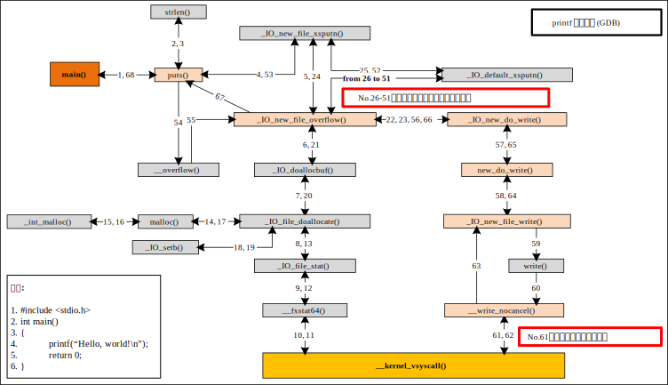
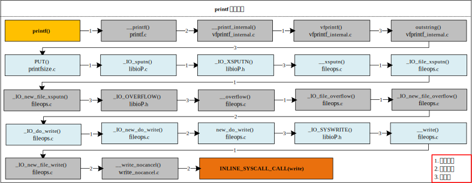

# printf底层调用分析

对于编译型语言，程序的运行需要经过预编译、编译、汇编和链接四个步骤。接下来以```printf```函数为例，分别使用动态```GDB```调试和静态源码分析获取其底层实现流程。

测试环境为：

平台|版本
:----: | :---:
处理器 | Intel i5-8257U
操作系统 | Ubuntu 20.04
内核 | Linux kernel 5.8.0
编译器 | gcc 9.3.0

测试代码如下：
```c
#include <stdio.h>

int main()
{
    printf("Hello, world!\n");
    return 0;
}
```

## 编译过程
首先，预编译会替换源码中的宏，如```#include```。预编译结束后，可以在被修改的源程序中看到```printf```的声明：
```
$ gcc -E hello.c -o hello.i
```
```c
...
extern int printf (const char *__restrict __format, ...);
...
int main()
{
    printf("Hello, world!\n");

    return 0;
}
```

然后，编译器将高级语言转换为汇编代码：
```
$ gcc -S hello.i -o hello.s
```
```asm
	.file	"hello.c"
	.text
	.section	.rodata
.LC0:
	.string	"Hello, world!"
	.text
	.globl	main
	.type	main, @function
main:
.LFB0:
	.cfi_startproc
	endbr64
	pushq	%rbp
	.cfi_def_cfa_offset 16
	.cfi_offset 6, -16
	movq	%rsp, %rbp
	.cfi_def_cfa_register 6
	leaq	.LC0(%rip), %rdi
	call	puts@PLT
	movl	$0, %eax
	popq	%rbp
	.cfi_def_cfa 7, 8
	ret
...
```

从汇编代码中可以看出，```printf```函数被转换成了```call puts```指令，而不是```call printf```指令。究其原因，这是编译器对```printf```函数的优化，如果```printf```的参数是以```‘\n’```结束的纯字符串，则```printf```函数会被优化为```puts```函数，且字符串末尾的```‘\n’```被消除；否则，将会正常输出```call printf```指令。

接下来，汇编器将汇编代码转换成可重定位目标文件，此文件是二进制格式，不能直接阅读，可以使用```objdump```对该文件进行反汇编：
```
$ gcc -c hello.s -o hello.o
$ objdump -d hello.o
```
```asm
0000000000000000 <main>:
   0:	f3 0f 1e fa          	endbr64 
   4:	55                   	push   %rbp
   5:	48 89 e5             	mov    %rsp,%rbp
   8:	48 8d 3d 00 00 00 00 	lea    0x0(%rip),%rdi        # f <main+0xf>
   f:	e8 00 00 00 00       	callq  14 <main+0x14>
  14:	b8 00 00 00 00       	mov    $0x0,%eax
  19:	5d                   	pop    %rbp
  1a:	c3                   	retq   
```
从反汇编代码中可以看到，```call puts```指令中保存了无效的符号地址。

最后，链接器修正```call puts```的符号地址。在链接时，有静态链接和动态链接两种方式，链接方式的不同不会影响函数的调用，此处为了分析方便，以静态链接方式分析目标文件的反汇编代码：
```
$ gcc -static hello.s -o hello
$ objdump -d hello
```
```asm
...
0000000000401d35 <main>:
  401d35:	f3 0f 1e fa          	endbr64 
  401d39:	55                   	push   %rbp
  401d3a:	48 89 e5             	mov    %rsp,%rbp
  401d3d:	48 8d 3d c0 32 09 00 	lea    0x932c0(%rip),%rdi        # 495004 <_IO_stdin_used+0x4>
  401d44:	e8 67 fb 00 00       	callq  4118b0 <_IO_puts>
  401d49:	b8 00 00 00 00       	mov    $0x0,%eax
  401d4e:	5d                   	pop    %rbp
  401d4f:	c3                   	retq   
...
```
此时，```call puts```的符号地址被修正，但反汇编显示的符号是```_IO_puts```。通过使用```readelf```查看```hello```的符号表，可以发现```_IO_puts```和```puts```两个符号性质等价，```objdump```显示了全局符号```_IO_puts```：
```
$ readelf -s hello
```
```asm
 Num:    Value          Size Type    Bind   Vis      Ndx Name
 ...
 976: 00000000004118b0   476 FUNC    WEAK   DEFAULT    7 puts
 ...
1279: 00000000004118b0   476 FUNC    GLOBAL HIDDEN     7 _IO_puts
 ...
```

## 调用轨迹

分析完程序的编译过程，接下来寻找```printf```的调用轨迹。选择静态链接后的二进制程序```hello```，然后使用```gdb```调试：

```
$ gcc -g hello.c -o hello
$ gdb ./hello
```
在```main```函数开始设置断点，执行后，不断使用```stepi```单步步入下一条指令，直到输出```Hello, world!```为止：
```shell
(gdb) break main
(gdb) run
(gdb) stepi
```
```shell
(gdb) 
0x0000000000448875 in write ()
(gdb) 
Hello, world!
```
可以看到输出```Hello, world!```上一行代码为止是```0x0000000000448875```，查看此处汇编代码：
```
(gdb) disassemble
```
```shell
Dump of assembler code for function write:
   0x0000000000448860 <+0>:	endbr64 
   0x0000000000448864 <+4>:	mov    %fs:0x18,%eax
   0x000000000044886c <+12>:	test   %eax,%eax
   0x000000000044886e <+14>:	jne    0x448880 <write+32>
   0x0000000000448870 <+16>:	mov    $0x1,%eax
   0x0000000000448875 <+21>:	syscall 
```

从汇编代码中可以看到，在```0x0000000000448875```处调用了```syscall```指令，且存储在```%eax```寄存器中的系统调用号为```0x1```，即```write```系统调用。

通过记录从```main```函数开始到返回```main```函数的所有函数调用，可以得到下图所示的函数调用关系：



图中矩形表示函数和其调用的中间函数，箭头表示调用关系，箭头左边表示调用者函数，箭头右边表示被调函数，箭头上的数字表示第```n```次函数调用（以```main```函数调用```puts```函数为第```1```次调用），矩形内使用其他颜色标记的表示```puts```函数实现功能的主要流程。

从图中可以看到，从```main```函数调用开始，到返回```main```函数，共发生了```68```次函数调用，其中第```26```到第```51```次函数调用（```26```次）是将```“hello, world!”``` ```13```个字符依次放入缓冲区中。第```61```次调用了```write```系统调用将字符串输出到终端。对于第```6```到第```21```次函数调用，其功能是处理栈和内存分配等。

## 源码分析



## 参考链接：
[printf背后的故事](https://www.cnblogs.com/fanzhidongyzby/p/3519838.html)
